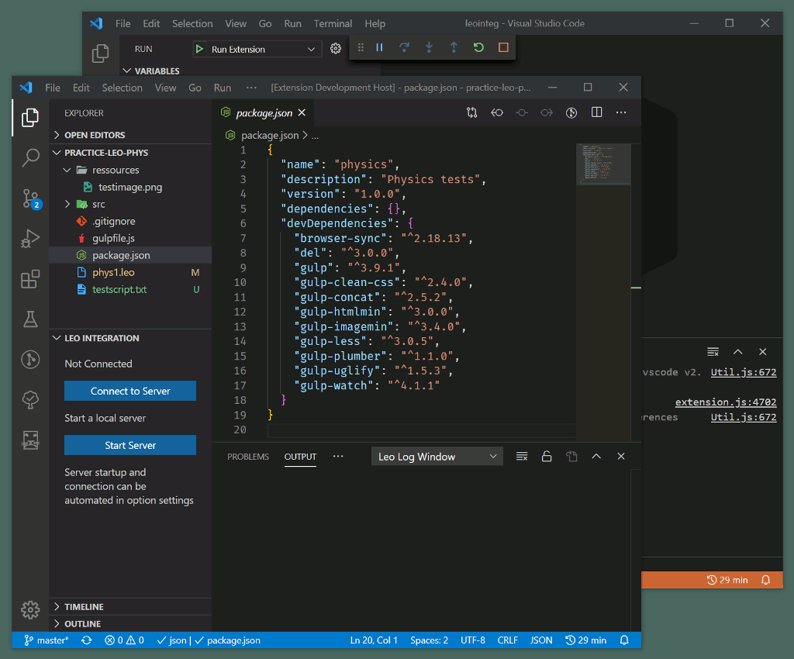

# How to install and run the development version

Thanks for trying out the development version of LeoInteg!

If you're completely new to vscode and want to try out Leo as an extension to vscode, you might want to look at this ['Getting Started' page](https://code.visualstudio.com/docs#vscode-in-action) to get an overview of vscode.

Furthermore, if you've never ran a vscode extension in an **Extension Development Host**, here is a [short overview about running and modifying a simple extension](https://code.visualstudio.com/api/get-started/your-first-extension)

## Development requirements

- Make sure you have Node.js and Git installed. Also check your Node.js and vscode versions by opening the 'about' dialog from the help menu in vscode. You should at least match or exceed the versions below.

On Windows:

> Version: 1.45.1\
> Commit: 5763d909d5f12fe19f215cbfdd29a91c0fa9208a\
> Date: 2020-05-14T08:27:35.169Z\
> Electron: 7.2.4\
> Chrome: 78.0.3904.130\
> Node.js: 12.8.1\
> V8: 7.8.279.23-electron.0\
> OS: Windows_NT x64 10.0.17763

On Linux:

> Version: 1.45.1\
> Commit: 5763d909d5f12fe19f215cbfdd29a91c0fa9208a\
> Date: 2020-05-14T08:27:22.494Z\
> Electron: 7.2.4\
> Chrome: 78.0.3904.130\
> Node.js: 12.8.1\
> V8: 7.8.279.23-electron.0\
> OS: Linux x64 5.5.5-050505-generic

## Getting the source and its development dependencies

- Clone the repository using the command line by typing : `git clone https://github.com/boltex/leointeg.git`

- Although you could 'cd' into the leoInteg folder and run some commands from the same terminal, let's instead use the terminal from within vscode. So open the leoInteg folder with vscode instead:

- With vscode now opened with the **leoInteg folder as its workspace**, use the `ctrl+shift+p` keyboard shortcut to open command palette and toggle the terminal. (You can find any command through the command palette)

- Install the expansion's dependencies with by using the `npm install` command. **(Important if you also just _pulled_ updated sources)**

- When the command has finished running, you should see that a new **node_modules** folder was created.

- You're now ready to run the development version of the leoInteg extension.

## Choosing a debug profile

- Bring up the Run view, by selecting the Run icon in the Activity Bar.\
  _Highlighted in the screenshot below_

- When simply running the extension, choose the 'extension' profile.

- To contribute to the python server script, and/or run it inside the vscode debugger, you will need to install the [python development extension](https://marketplace.visualstudio.com/items?itemName=ms-python.python) and choose one of the other profiles that include the server script.

## Starting the extension

- Press F5 (the 'Start Debugging' command) to start another vscode window with the expansion 'installed' and running in it.

- If any problems occurred during the extension compilation it will be logged in the vscode instance that started the debug process in its 'task-webpack' terminal panel. Otherwise if its running, the extension itself will be logging any messages in the debug-console panel. (See animation below)

## The python server script

- The leoInteg extension needs the leobridgeserver.py python script to be running. That is where the two extra extension requirements come into play: Having [Leo's path made available in the \$PYTHONPATH environment variable](https://github.com/leo-editor/leo-editor/blob/master/INSTALL.TXT#L126), and having the [Websocket Python Library installed](https://websockets.readthedocs.io/en/stable/intro.html)

### This server script can be started in various way

- You can have LeoInteg try to start a server script instance itself via the 'Start Server' command or button. It will use the 'py' command on Windows and 'python3' command on other OSes by default. _You can automate this process via leoInteg's configuration settings._
- You can have the vscode **Debug View** start it by choosing a debug profile that includes the server script. It's then possible to step in, inspect and debug the python server script. _The [python development extension](https://marketplace.visualstudio.com/items?itemName=ms-python.python) is needed for this._
- You can also start it yourself manually, by running the leobridgeserver.py script from a command prompt.

### Using Anaconda or other custom python installations

- LeoInteg provides configuration options to specify how to launch python interpreter but this may not be enough to get it to start on your system, see [#10](https://github.com/boltex/leointeg/issues/10) and other issues relating to configurations in _sitecustomize.py_ file as noted in [Leo's google group forum](https://groups.google.com/d/msg/leo-editor/FAP8lVnWLyQ/lWHWEYH9AgAJ).

- If Leointeg or vscode cannot start running the server script on you system or OS, a **workaround** is to start the server script beforehand manually with whichever python interpreter you have installed.

- It will terminate automatically when a user disconnect.

Note: If force-closing it from the integrated vscode terminal, use the 'Kill terminal' button instead of the 'X' that just hides it by closing the panel.

