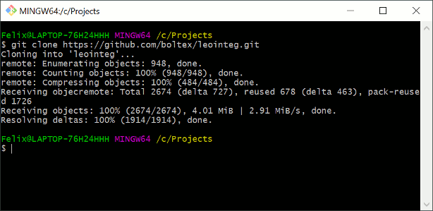

# How to install and run the development version

Thanks for trying out the development version of LeoInteg! :sunglasses: Contributions and pull requests are more than welcome!

## Introduction

[Video tutorial of installation and startup](https://www.youtube.com/watch?v=rutt11xL54I):

If you're new to vscode and want to try out Leo with this vscode extension, you might want to look at this [Getting Started](https://code.visualstudio.com/docs#vscode-in-action) page to get an overview of vscode.

Furthermore, if you've never ran a vscode extension in an **Extension Development Host**, here is a [short overview about running and modifying a simple extension](https://code.visualstudio.com/api/get-started/your-first-extension).

If you're having problems with the procedures below, try [running this sample extension](https://github.com/Microsoft/vscode-extension-samples/tree/master/helloworld-sample#running-the-sample) first to catch underlying problems or missing dependencies.

## Development requirements

- **use Leo's 'devel' branch** (This is temporary until Leo's 6.4 release)

- Make sure you have [Node.js](https://nodejs.org/en/download/) and [Git](https://git-scm.com/downloads) installed.

- Also check your vscode, and other software versions by opening the 'about' dialog from the help menu. You should at least match or exceed the versions below.

On Windows:

On Linux:

## Getting the source and its development dependencies

- Clone the repository using the command line by typing : `git clone https://github.com/boltex/leointeg.git`

- Although you could 'cd' into the leoInteg folder and run some commands from the same terminal, let's instead use the terminal from within vscode. So open the leoInteg folder with vscode instead, either with the context menu as shown below, or by choosing "Open Folder..." from within vscode:

- With vscode now opened with the **leoInteg folder as its workspace**, use the `ctrl+shift+p` keyboard shortcut to open command palette and toggle the terminal. (You can find any command through the command palette)

- Install the development dependencies by entering the `npm install` command in the terminal. **(Important if you also just _pulled_ updated sources)**

- When the command has finished running, you should see logged results in the terminal and also that a new **node_modules** folder was created.

- You're now ready to **compile and run** the development version of the leoInteg extension.

## Choosing a debug profile

- Bring up the **Run view**, by selecting the Run icon in the **Activity Bar**. _(Screenshot below)_

- When simply running the extension, choose the **Run Extension** profile.

> (**Optional**) To contribute code to the python server script, or run it through the vscode debugger, you may need to install the [python development extension](https://marketplace.visualstudio.com/items?itemName=ms-python.python).

- For simply running and using leoInteg, just start the extension and the server as shown below.

## Starting the extension

- Use the **Start Debugging** command (or press **F5**) to start another vscode window with the expansion _installed and running_ within it.

- If any problems occurred during the extension compilation it will be logged in the vscode instance that started the debug process in its **task-webpack** terminal panel. Otherwise if its running, the extension itself will be logging any messages in the **debug-console** panel. (See animation below)

## The python server script

- This extension needs the **`leobridgeserver.py`** or the **`leoserver.py`** script to be running from Leo's own installation folder. That is where the two extra extension requirements come into play:

## Server Script Requirement

- Having the [Websocket Python Library installed](https://websockets.readthedocs.io/en/stable/intro.html)

### 3 ways to start the server script

1. You can have LeoInteg try to start a server script instance itself via the **Start Leo Server** command or button. It will use the 'py' command on Windows and 'python3' command on other OSes by default. _You can automate this process via leoInteg's configuration settings._
2. You can have vscode's **Debug View** start it, as a debug session starts, by choosing a debug profile that includes the server script. It's then possible to step in, inspect and debug the python server script. _The [python development extension](https://marketplace.visualstudio.com/items?itemName=ms-python.python) may be required._
   **If using those debug view profiles, the server files have to be de-commented from the leointeg.leo file, or copied from the leo-editor/leo/core folder.**
3. You can also start it yourself manually, by running the leoserver.py script (preferably from your leo-editor/leo/core folder) in a terminal or command prompt of your liking.

### Using Anaconda or other custom python installations

- LeoInteg provides configuration options to specify how to launch python interpreter but this may not be enough to get it to start on your system, see [#10](https://github.com/boltex/leointeg/issues/10) and other issues relating to configurations in _sitecustomize.py_ file as noted in [Leo's google group forum](https://groups.google.com/d/msg/leo-editor/FAP8lVnWLyQ/lWHWEYH9AgAJ).

- If Leointeg or vscode cannot start running the server script on you system or OS, a **workaround** is to start the server script beforehand manually with whichever python interpreter you have installed.

- It will terminate automatically when a user disconnect.

**Note**: If force-closing the server from the integrated vscode terminal, use the 'Kill terminal' button instead of the 'X' that just hides the panel.

## Issues

More information can be found on the repository's [Issues Page](https://github.com/boltex/leointeg/issues), where details and troubleshooting can be addressed more directly.
