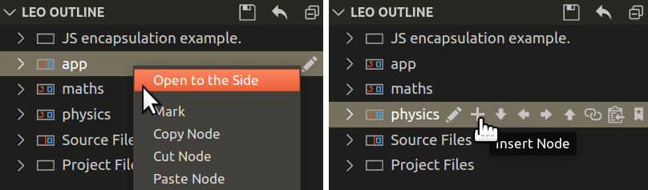
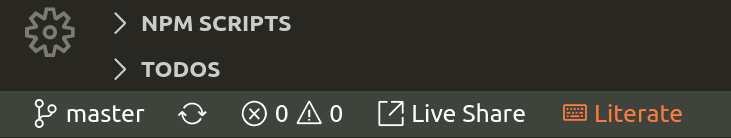
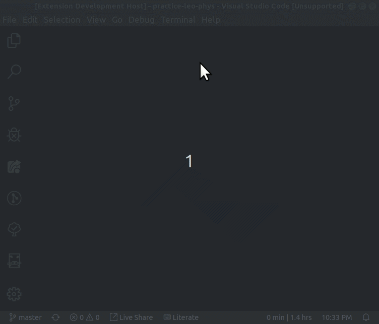

#  Leo Editor Integration with Visual Studio Code

## Literate programming

Program by using directed acyclic graphs, section-references, clones, '@other' and the Mulder/Ream update algorithm to derive your files, or parse them back into an outline!

See Leo, the Literate Editor with Outline, at [leoeditor.com](https://leoeditor.com/) or on [github.com/leo-editor](https://github.com/leo-editor/leo-editor)

## Requirements

- Leo installed
- Leo's path made available in \$PYTHONPATH environment variable\
  (See **Adding Leo to Your Path** in [github.com/leo-editor/leo-editor/blob/master/INSTALL.TXT](https://github.com/leo-editor/leo-editor/blob/master/INSTALL.TXT#L126))
- Websocket Python Library installed\
  _Install with :_ `pip install websockets`\
  (See [websockets.readthedocs.io/en/stable/intro.html](https://websockets.readthedocs.io/en/stable/intro.html))

## Development version installation

Make sure you have Node.js and Git installed along with the above general requirements, then:

1. Get this repository: `git clone https://github.com/boltex/leointeg.git`
2. Right-click it -> open with vscode (or from a vscode window, File-> Open Folder...)
3. Run `npm install` in terminal before the first run to install dependencies.
4. Press F5 (the 'Run Extension' shortcut)

After compiling, a new vscode window will be running with leoInteg.
The plugin will be activated if the workspace of this new window contains a leo file, or it can also be manually activated by going to the Leo view.

Once activated, it will start a bridge and connect to it automatically by default. The 'Open Leo File' icon will then be available.

## Features

### _Features done so far_

- A welcome screen for easy access to this expansion's settings.
- Derived files automatic writing and refreshing
- Leo outline below the explorer view, or in its own panel.
- Access Leo commands via context menus, outline-node hover icons, keyboard shortcuts, or the command palette:
  - Open body panes to the side
  - Outline edition commands
  - Clipboard operations
  - Undo operation

| Keybinding                 |     |                       | Command            |
| :------------------------- | :-- | :-------------------- | :----------------- |
| `Ctrl + I`                 |     |                       | Insert Node        |
| `Ctrl + H`                 |     |                       | Edit Headline      |
| `Ctrl + Shift + C`         |     |                       | Copy Node          |
| `Ctrl + Shift + X`         |     |                       | Cut Node           |
| `Ctrl + Shift + V`         |     |                       | Paste Node         |
| `Ctrl + Shift + Backspace` |     |                       | Delete Node        |
| `Ctrl + M`                 |     |                       | Mark / Unmark      |
| `Ctrl + {`                 |     | `Ctrl + }`            | Promote / Demote   |
| `Ctrl + U`                 | or  | `Shift + Alt + Up`    | Move Outline Up    |
| `Ctrl + D`                 | or  | `Shift + Alt + Down`  | Move Outline Down  |
| `Ctrl + L`                 | or  | `Shift + Alt + Left`  | Move Outline Left  |
| `Ctrl + R`                 | or  | `Shift + Alt + Right` | Move Outline Right |

## _Status Bar Indicator_

A 'Literate' Keyboard status bar indicator is shown when this extension is activated. It will turn orange to show when leo's **keyboard shortcuts** are active: This occurs when an outline node or a body pane has focus:

## Issues

For most users, **`Ctrl+D`** is often already assigned to some useful command. To help with this conflict, move commands will only trigger at an additional condition of having no text selection in the editor. So select at least one character to use the usual **`Ctrl+D`** vscode command in body panes.

## Extension Settings

### _Open the command palette and start typing_ `leo settings`

- Control the visibility of the outline pane in the explorer view.
- Choose to either focus on the body pane, or keep focus in the outline when a tree node is selected.
- Show additional icons on tree nodes (Move, delete, mark, copy, paste...)
- Show "Open on the side" in the context menu for a tree node's body to open beside the current body pane.
- Set the number of milliseconds to wait when debouncing after body text modifications are detected. (for performance tuning)
- Set preferences for setting the address and port, and for automatically starting, and connecting to a Leo Bridge server.

## Intended Features

- Provide most of Leo's core functionality, outline, body & log panes, color-syntaxing, shortcuts, etc.
- Find specific line(s) from derived files in tree nodes (For error lookup, breakpoints cycling, etc.)
- Show line number from the derived file instead of the body-pane's line number
- Support for multiple, simultaneous body panes from different nodes.

## How it works

Integration is done by starting a python server script and connecting to it via a websocket to exchange JSON data. That python script leverages [leoBridge](https://leoeditor.com/leoBridge.html) and re-uses code from the leoflexx.py plugin.

The outline pane is made by implementing a TreeDataProvider for vscode's TreeView API, while the body panes are made by defining a 'leo' filesystem scheme with vscode's FileSystemProvider API, and using the node's gnx as identifiers.

## Acknowledgments

### _Thanks to_

- [Edward K. Ream](https://github.com/edreamleo) creator of the [Leo Editor](https://leoeditor.com/)
- [Eric Amodio](https://github.com/eamodio) for the [welcome screen template](https://github.com/eamodio/vscode-gitlens/tree/master/src/webviews)
- [Vitalije](https://github.com/vitalije) for his contributions and support

---

**Enjoy!**
