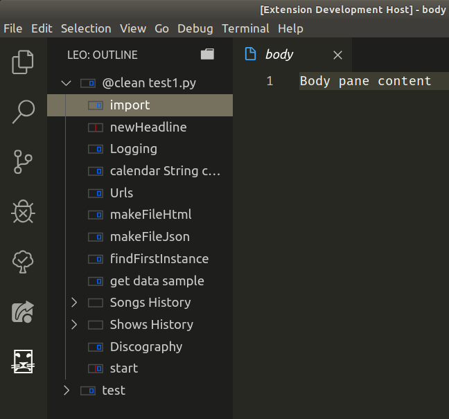

#  Leo editor integration with Visual Studio Code.

See Leo, the Literate Editor with Outline at: https://leoeditor.com/

## Features

_As a starting point, here are a couple of intended features:_

Integration done with a python script. It interacts with leo via 'leoBridge'. (see https://leoeditor.com/leoBridge.html)

A treeview of an actual outline of a leo file. Maybe integrated below the explorer view, or standalone in its own panel.

When in this 'leo-integration' mode, the functionality of vscode is altered to suit the interactions with the opened leo file. (For example: by re-maping shortcut keys to the familiar tree-editing shortcut keys of Leo.)

An appropriate editor on the right side, acting as the body pane.

2 way synchronisation of leo's output files and vscode's explorer & 'normal mode' of operation.

Error lookup, or breakpoints cycling with automatic go-to line in generated file's nodes and body position, in the outline itself. (Reproducing xcc-nodes behaviour see http://xccnode.sourceforge.net/)

File generating 'at' nodes that show their derived line number instead of the body-pane's line number (Also reproducing xcc-nodes behaviour)

more to be added...

## Requirements

- Leo installed
- Leo's path made available in \$PYTHONPATH

(Needed so python imports work. e.g. `import leo.core.leoBridge as leoBridge` )

## Extension Settings

Planned Settings :

- Option to focus on body pane or keep focus in outline when a tree node is selected (May help for keyboard navigation)

- Milliseconds to wait when debouncing after body text modifications are detected (for performance tuning)

- Settings for communicating either locally, via stdIn/out, and remotely over tcp, through a rest api or websockets. (communication consists of simple JSON data)

- Graphic-related settings such as light/dark theme and icon set selection

---

**Enjoy!**
