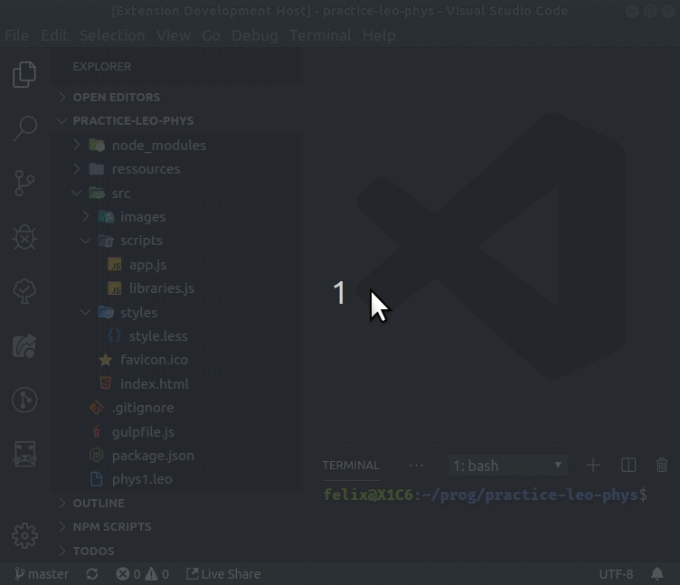
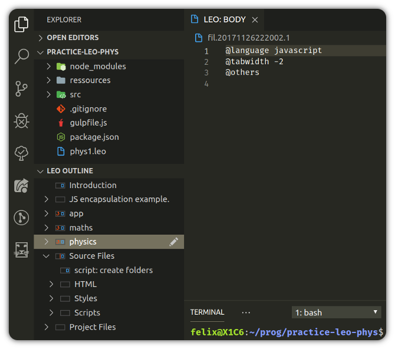

#  Leo Editor Integration with Visual Studio Code

## Literate programming

Program by using directed acyclic graphs, section-references, clones, '@other' and the Mulder/Ream update algorithm to either derive your files, or parse them back into an outline!

See Leo, the Literate Editor with Outline at: https://leoeditor.com/ or on GitHub https://github.com/leo-editor/leo-editor

## Requirements

- Leo installed
- Leo's path made available in \$PYTHONPATH environment variable\
  (See **Adding Leo to Your Path** in https://github.com/leo-editor/leo-editor/blob/master/INSTALL.TXT)
- Websocket Python Library - _Install with_ : `pip install websockets`\
  (See https://websockets.readthedocs.io/en/stable/intro.html)

## Development version installation

### _Want to try out this development version?_

Make sure you have Node.js and Git installed along with the above general requirements, then:

1. Get this repository: `git clone https://github.com/boltex/leointeg.git`
2. Right-click that folder -> open with vscode, or, from inside a vscode window, File-> Open Folder...
3. Run `npm install` in terminal to install dependencies.
4. Press F5. (the 'Run Extension' command shortcut of vscode's debug panel)
5. A new vscode window is now running with leoInteg! (open it's preferences settings [ctrl+,] and make sure server settings are ok)
6. The plugin will be activated if the workspace of this window has a leo file, or it can be manualy activated, by going to the Leo view.
7. Once activated, it will start a bridge and connect to it by default automatically. The 'Open Leo File' icon will then be available.

## Features

### _Features done so far:_

- Integration is done by communicating with a python script, it interacts with Leo via 'leoBridge'. (see https://leoeditor.com/leoBridge.html)
- A treeview of an actual outline of a Leo file. Can be integrated below the explorer view, or standalone in its own panel.
- Editors on the right side, acting as the body pane(s).
- Extension-specific settings for user interface preferences: _Available in settings_ `[ctrl+,]`

## Extension Settings

- Option to either focus on body pane or keep focus in outline when a tree node is selected. (May help for keyboard navigation)
- Control the visibility of the outline pane in the explorer view.
- Show additional context menu item : "Open on the side" for tree node's body to open beside current body pane.
- Number of milliseconds to wait when debouncing after body text modifications are detected. (for performance tuning)
- Preferences for setting the address and port, and for automatically starting, and connecting to a Leo Bridge server.

## _Intended Features:_

- Re-mapping of most of Leo's outline editing features through vscode and more, via leoBridge.
- Detection of focused element to toggle functionality, by re-maping shortcut keys, to suit the interactions with the opened Leo file.
- 2 way synchronization of leo's output files and vscode's explorer & 'normal mode' of operation.
- Error lookup, or breakpoints cycling with automatic go-to line in generated file's nodes and body position.
- File generating 'at' nodes that show their derived line number instead of the body-pane's line number along with color-syntaxing.

---

**Enjoy!**
