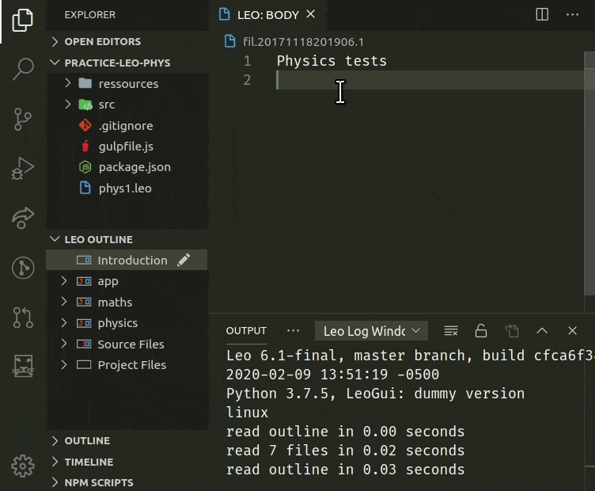
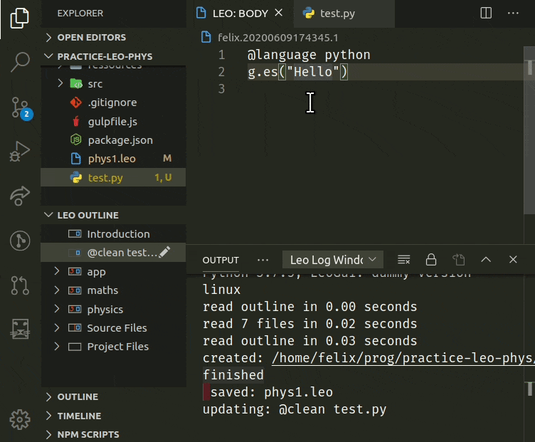
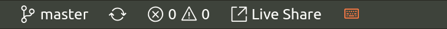

#  Leo Editor Integration with Visual Studio Code

## Literate Programming with _Directed Acyclic Graphs_ ([dag](https://en.wikipedia.org/wiki/Directed_acyclic_graph))

### Break your code down into sections structured as an outline, to derive or parse back your files

> Leo is a fundamentally different way of using and organizing data, programs and scripts.

See Leo, the Literate Editor with Outline, at [leoeditor.com](https://leoeditor.com/)
or on [github](https://github.com/leo-editor/leo-editor), and vscode at [code.visualstudio.com](https://code.visualstudio.com/).

## Requirements

- Having [Leo's path made available in the \$PYTHONPATH environment variable](https://docs.python.org/2/using/windows.html#excursus-setting-environment-variables)\
  ([More info](https://docs.python.org/2/using/cmdline.html#environment-variables))
- Having the Websocket Python Library installed.
  _Install with :_ `pip install websockets`\
  (See [websockets.readthedocs.io/en/stable/intro.html](https://websockets.readthedocs.io/en/stable/intro.html))

## Development version installation

In addition to the above requirements, make sure you have Node.js and Git installed, then clone the sources and run `npm install` in a terminal to install the remaining development dependencies.

You can then run the **Run Extension** target, as shown above, in the **Debug View**.

> See [CONTRIBUTING.md](CONTRIBUTING.md) for complete details on how to install and run this extension.

## Features

- A **Leo Outline** in the explorer view, or as a standalone sidebar, **body panes** and **Log Window**.
- A **welcome screen** that also gives access to this extension's **settings**.
- **Derived files change detection**. See [External Files](#derive-external-files) below for more details
- Access **Leo commands** with context menus, outline-node hover icons, keyboard shortcuts, or the command palette:
  - Open body panes to the side
  - Outline edition commands
  - Clipboard operations
  - Undo/Redo commands

## Keybindings

> _More commands are available by opening the **Command Palette** and typing 'Leo'_

| Keybinding                 |     |                       | Command            |
| :------------------------- | :-- | :-------------------- | :----------------- |
| `Alt + -`                  |     |                       | Contract All       |
| `Ctrl + I`                 |     |                       | Insert Node        |
| `Ctrl + H`                 |     |                       | Edit Headline      |
| `Ctrl + Backquote`         |     |                       | Clone Node         |
| `Ctrl + Shift + C`         |     |                       | Copy Node          |
| `Ctrl + Shift + X`         |     |                       | Cut Node           |
| `Ctrl + Shift + V`         |     |                       | Paste Node         |
| `Ctrl + Shift + Backspace` |     |                       | Delete Node        |
| `Ctrl + M`                 |     |                       | Mark / Unmark      |
| `Ctrl + {`                 |     | `Ctrl + }`            | Promote / Demote   |
| `Ctrl + U`                 | or  | `Shift + Alt + Up`    | Move Outline Up    |
| `Ctrl + D`                 | or  | `Shift + Alt + Down`  | Move Outline Down  |
| `Ctrl + L`                 | or  | `Shift + Alt + Left`  | Move Outline Left  |
| `Ctrl + R`                 | or  | `Shift + Alt + Right` | Move Outline Right |

## Derive External Files

Use the **Save Leo File** command to derive external files.

Leo will detect derived file changes and will ask to either **refresh from disk** or **ignore the changes**.

## Automate Synchronization

The **change detection** process can be automated to always refresh, or ignore file changes: A **notification** will inform you of the action taken instead.

## Status Bar Indicator

A customizable keyboard status bar indicator is shown when this extension is activated.
It will turn orange (or your choice of text and color), when leo's **keyboard shortcuts** are active.
This occurs when an outline node or a body pane has focus:

## Extension Settings

### Open the command palette `CTRL+SHIFT+P` and start typing `leo settings` to access LeoInteg's welcome/settings screen

> _(Changes are auto-saved to the user's profile after 0.5 seconds)_

- Control the visibility of the outline pane in the explorer view.
- Decide how and when to refresh and synchronize content when derived (external) file are modified.
- Show additional icons on outline nodes (Move, delete, mark, copy, paste...)
- Choose to either focus on the body pane, or keep focus in the outline when a node is selected.
- Hide or show the "Open on the side" command in the context menu to open a node beside the active editor
- Set preferences for setting the address and port, and for automatically starting, and/or connecting, to a Leo Bridge server.

## Issues

Main issues are listed below. See the repository's [Issues Page](https://github.com/boltex/leointeg/issues) to submit issues.

### Linux Keybindings

If you're experiencing trouble with the keyboard shortcuts for
the 'Clone Node' or the 'Promote' and 'Demote' commands,
use **"keyboard.dispatch": "keyCode"** in your settings and restart vscode.
See [Troubleshoot Linux Keybindings](https://github.com/microsoft/vscode/wiki/Keybinding-Issues#troubleshoot-linux-keybindings) for more information.

### Move outline keyboard commands

For some users, the **`Ctrl+D`** keybinding is already assigned.
To help with this conflict, outline-move keyboard commands will only trigger
with the additional condition of having no text selection in the editor.
So select at least one character to use the previously assigned **`Ctrl+D`** command in body panes.

> This extension is still in development, so please refer to its [issue tracker for known issues](https://github.com/boltex/leointeg/issues), and please contribute with additional information if you encounter other issues yourself.

## Intended Features

- Support for multiple simultaneous opened Leo files.
- Support multiple connections to the leoBridge server.
- Syntax-highlighting for body panes that matches Leo's syntax-highlighting.
- Display line numbers in relation to derived files, along with 'go-to' specific line functionality for error lookups and breakpoints.

## How it works

Integration is done by starting a python server script and connecting to it via a websocket to exchange JSON data. That script leverages [leoBridge](https://leoeditor.com/leoBridge.html) and re-uses code from the leoflexx.py plugin.

The outline pane is made by implementing a TreeDataProvider for vscode's TreeView API, while the body panes are made by implementing a filesystem provider and using the node's gnx as identifiers.

## Acknowledgments

### _Thanks to_

- [Edward K. Ream](https://github.com/edreamleo) creator of the [Leo Editor](https://leoeditor.com/)
- [Eric Amodio](https://github.com/eamodio) for the [welcome screen templates](https://github.com/eamodio/vscode-gitlens/tree/master/src/webviews)
- [Vitalije](https://github.com/vitalije) for his contributions and support

---

**Enjoy!**
