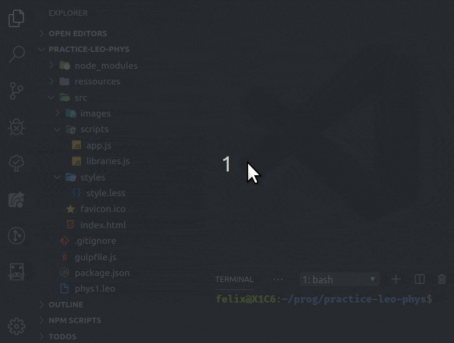

#  Leo Editor Integration with Visual Studio Code

## Literate programming

Program by using directed acyclic graphs, section-references, clones, '@other' and the Mulder/Ream update algorithm to either derive your files, or parse them back into an outline!

See Leo, the Literate Editor with Outline, at [leoeditor.com](https://leoeditor.com/) or on [github.com/leo-editor](https://github.com/leo-editor/leo-editor)

## Requirements

- Leo installed
- Leo's path made available in \$PYTHONPATH environment variable\
  (See **Adding Leo to Your Path** in [github.com/leo-editor/leo-editor/blob/master/INSTALL.TXT](https://github.com/leo-editor/leo-editor/blob/master/INSTALL.TXT#L126))
- Websocket Python Library installed\
  _Install with :_ `pip install websockets`\
  (See [websockets.readthedocs.io/en/stable/intro.html](https://websockets.readthedocs.io/en/stable/intro.html))

## Development version installation

### _Want to try out this development version?_

Make sure you have Node.js and Git installed along with the above general requirements, then:

1. Get this repository: `git clone https://github.com/boltex/leointeg.git`
2. Right-click that folder -> open with vscode, or, from inside a vscode window, File-> Open Folder...
3. Run `npm install` in terminal before the first run to install dependencies.
4. Press F5 (the 'Run Extension' shortcut) - A new vscode window is now running with leoInteg!

The plugin will be activated if the workspace of this new window contains a leo file, it can also be manually activated by going to the Leo view.

Once activated, it will start a bridge and connect to it automatically by default. The 'Open Leo File' icon will then be available. _For more info see 'How it works' at the bottom of this readme._

## Features

### _Features done so far:_

- A Settings/Welcome screen. (Open the command palette, type `leo Welcome` or `leo Settings`)
- A treeview of an actual outline of a Leo file. Can be integrated below the explorer view, or standalone in its own panel.
- Editors on the right side, acting as the body pane(s).
- Extension-specific settings for user interface preferences: _Available in settings_ `[ctrl+,]`

## Extension Settings

### (Open the command palette and start typing `leo settings` to access the settings/welcome screen)

- Control the visibility of the outline pane in the explorer view.
- Choose to either focus on body pane or keep focus in outline when a tree node is selected. (May help for keyboard navigation)
- Show additional context menu item : "Open on the side" for tree node's body to open beside current body pane.
- Set the number of milliseconds to wait when debouncing after body text modifications are detected. (for performance tuning)
- Set preferences for setting the address and port, and for automatically starting, and connecting to a Leo Bridge server.

## Intended Features

- Re-mapping of most of Leo's outline editing features through vscode and more, via leoBridge.
- Detection of focused element to toggle functionality, by re-mapping shortcut keys, to suit the interactions with the opened Leo file.
- 2 way synchronization of leo's output files and vscode's explorer & 'normal mode' of operation.
- Error lookup, or breakpoints cycling with automatic go-to line in generated file's nodes and body position.
- File generating 'at' nodes that show their derived line number instead of the body-pane's line number along with color-syntaxing.

## How it works

Integration is done by starting a python server script and connecting to it via a websocket to exchange JSON data. That python script leverages [leoBridge](https://leoeditor.com/leoBridge.html) and re-uses code from the leoflexx.py plugin.

The outline pane is made by implementing a TreeDataProvider for vscode's TreeView API, while the body panes are made by defining a 'fake' filesystem with vscode's FileSystemProvider API and then using vnode gnx as identifiers.

---

**Enjoy!**
