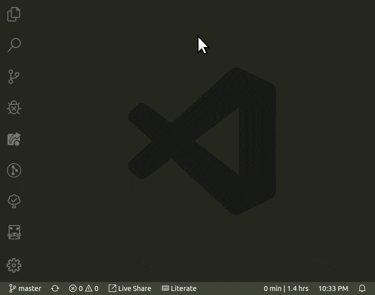

#  Leo Editor Integration with Visual Studio Code

## Literate programming

Program by using directed acyclic graphs, section-references, clones, '@other' and the Mulder/Ream update algorithm to either derive your files, or parse them back into an outline!

See Leo, the Literate Editor with Outline, at [leoeditor.com](https://leoeditor.com/) or on [github.com/leo-editor](https://github.com/leo-editor/leo-editor)

## Requirements

- Leo installed
- Leo's path made available in \$PYTHONPATH environment variable\
  (See **Adding Leo to Your Path** in [github.com/leo-editor/leo-editor/blob/master/INSTALL.TXT](https://github.com/leo-editor/leo-editor/blob/master/INSTALL.TXT#L126))
- Websocket Python Library installed\
  _Install with :_ `pip install websockets`\
  (See [websockets.readthedocs.io/en/stable/intro.html](https://websockets.readthedocs.io/en/stable/intro.html))

## Development version installation

Make sure you have Node.js and Git installed along with the above general requirements, then:

1. Get this repository: `git clone https://github.com/boltex/leointeg.git`
2. Right-click it -> open with vscode (or from a vscode window, File-> Open Folder...)
3. Run `npm install` in terminal before the first run to install dependencies.
4. Press F5 (the 'Run Extension' shortcut)

After compiling, a new vscode window will be running with leoInteg.
The plugin will be activated if the workspace of this new window contains a leo file, or it can also be manually activated by going to the Leo view.

Once activated, it will start a bridge and connect to it automatically by default. The 'Open Leo File' icon will then be available.

## Features

### _Features done so far_

- A welcome screen that also provides access to this expansion's configuration settings.
- A treeview implementation of an actual leo outline. It can be integrated below the files in the explorer's view, or it can be used in its own panel.
- Support for multiple, simultaneous body panes.
- Multiple commands: _Accessible either through context menus, on-hover icons, keyboard shortcuts, or the command palette_
  - Open body panes to the side.
  - Outline edition commands.
  - Clipboard operations
  - Undo operation.

| Keybinding                 |     |                       | Command            |
| :------------------------- | :-- | :-------------------- | :----------------- |
| `Ctrl + I`                 |     |                       | Insert Node        |
| `Ctrl + H`                 |     |                       | Edit Headline      |
| `Ctrl + Shift + C`         |     |                       | Copy Node          |
| `Ctrl + Shift + X`         |     |                       | Cut Node           |
| `Ctrl + Shift + V`         |     |                       | Paste Node         |
| `Ctrl + Shift + Backspace` |     |                       | Delete Node        |
| `Ctrl + M`                 |     |                       | Mark / Unmark      |
| `Ctrl + {`                 |     | `Ctrl + }`            | Promote / Demote   |
| `Ctrl + U`                 | or  | `Shift + Alt + Up`    | Move Outline Up    |
| `Ctrl + D`                 | or  | `Shift + Alt + Down`  | Move Outline Down  |
| `Ctrl + L`                 | or  | `Shift + Alt + Left`  | Move Outline Left  |
| `Ctrl + R`                 | or  | `Shift + Alt + Right` | Move Outline Right |

### _Status Bar Indicator_

A 'Literate' Keyboard status bar indicator is shown when this extension is activated. It will turn orange to show when leo's keyboard shortcuts are active: This occurs when a body pane has focus.

## Issues

Deleting a node that had opened body panes will cycle through your opened editors to search and close them. There is no current API command in vscode to close a particular editor so this cycling happens because 'next tab' and 'close active editor' commands are performed as a trick to close them. An appropriate command from the vscode api to fix this issue is on the way.

For most users, **`Ctrl+D`** is often already assigned to some useful command. To help with this conflict, move commands will only trigger at an additional condition of having no selection in the text. So select at least one character to use the usual **`Ctrl+D`** vscode command in body panes.

## Extension Settings

### _Open the command palette and start typing_ `leo settings`

- Control the visibility of the outline pane in the explorer view.
- Choose to either focus on the body pane, or keep focus in the outline when a tree node is selected.
- Show additional icons on tree nodes (Move, delete, mark, copy, paste...)
- Show "Open on the side" in the context menu for a tree node's body to open beside the current body pane.
- Set the number of milliseconds to wait when debouncing after body text modifications are detected. (for performance tuning)
- Set preferences for setting the address and port, and for automatically starting, and connecting to a Leo Bridge server.

## Intended Features

- 2 way synchronization of leo's output files and vscode's explorer.
- Error lookup, or breakpoints cycling with automatic go-to line in generated file's nodes and body position.
- File generating 'at' nodes that show their derived line number instead of the body-pane's line number along with color-syntaxing.

## How it works

Integration is done by starting a python server script and connecting to it via a websocket to exchange JSON data. That python script leverages [leoBridge](https://leoeditor.com/leoBridge.html) and re-uses code from the leoflexx.py plugin.

The outline pane is made by implementing a TreeDataProvider for vscode's TreeView API, while the body panes are made by defining a 'leo' filesystem scheme with vscode's FileSystemProvider API, and using the node's gnx as identifiers.

---

**Enjoy!**
